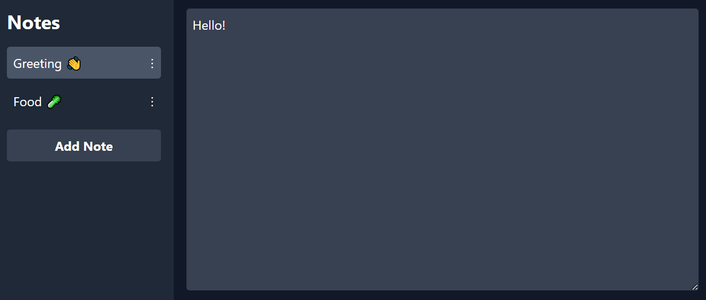

# Notepad

This is a simple web-based notepad application that allows users to create, edit, and store notes.

## Features

- **Create Notes**: Add new notes with a single click.
- **Edit Notes**: Edit the content and title of each note.
- **Save Automatically**: Changes are saved automatically as you type.

## How It Works

### Structure and Components

1. **HTML**:
   - **Header (`<head>`)**: Defines the title, links to the stylesheet (Tailwind CSS), and some inline styles.
   - **Body (`<body>`)**: Contains the main structure of the application, divided into two sections:
     - **Notes Menu**: A sidebar listing all notes and allowing the addition of new notes.
     - **Editing Area**: A larger area for editing the content of the selected note.

2. **CSS**:
   - **Tailwind CSS**: Used for quick and consistent styling.
   - **Custom Styles**: Additional CSS rules defined inline to handle the appearance of elements during interactions (e.g., when selected or edited).

3. **JavaScript**:
   - **Initialization**: Sets up the initial environment and creates the first note when the page loads.
   - **Note Management**: Handles creating new notes, loading the selected note's content, and updating the note's title and content.

### Key Functions

- **renderNotes**: Redraws the list of notes in the sidebar, highlighting the currently selected note.
- **loadNoteContent**: Loads the selected note's content into the editing area.
- **saveCurrentNoteContent**: Saves the content of the currently selected note.
- **saveNoteTitle**: Saves the new title of a note when edited.
- **addNoteBtn.onclick**: Adds a new note when the button is clicked, updates the notes list, and loads the new note for immediate editing.

[Click here to view the Notepad app](https://sutton-sn.github.io/notepad/)
